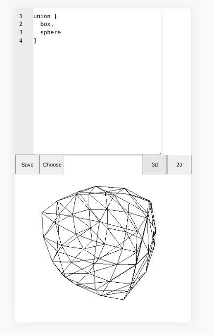

# Curv Playground

Write Curv code in your browser! The playground will send your code to the server
where its processed by Curv and returns a model to be viewed.

In the future Curv will return shader code which will run in a WebGPU context.

DO NOT USE THIS WHEN ON MOBILE DATA! Each render is about 2MB and will eat
your bandwidth.

Visit https://playground.curv3d.org !

## Setup your own

Make sure nodejs, npm and Curv is installed on the server. That should be all!

Run `npm install` to install the dependencies and then `node server.js` to start.

curv-playground will listen on port 9000 on localhost. This can be easily changed
in server.js.

## Alternative setup on server

You can run `cd ansible && ansible-playbook -i production -u root site.yml`

See `ansible/group_vars/services` for configurable variables.

## Context

I did this in the course of 7 hours, staying up from 10pm to 5am. It is not 
pretty but gets the job done reasonably.
